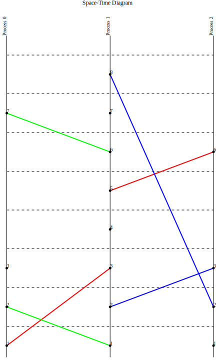

# Lamport clocks simulation

This project simulates a distributed system using Lamport clocks and visualizes the space-time diagram of the processes. The simulation reads an input file that describes the sequence of operations for each process, including local events, send, and receive operations. The resulting events are plotted on a space-time diagram to visualize the causality between events in different processes.

Heavily inspired by [Time, Clocks, and the Ordering of Events in a Distributed System](https://lamport.azurewebsites.net/pubs/time-clocks.pdf)

## Usage

To run the simulation, you need to provide an input file that describes the sequence of operations for each process. The format is as follows:

```txt
p0: s1 r1 l r1
p1: s0 s2 r0 l s2 s0 l r2
p2: l s1 r1 r1
```

Each line represents a process and its sequence of operations:
- `sN` - send a message to process N
- `rN` - receive a message from process N
- `l` - local event

### Command Line Flags
- `-i` : Path to the input file containing the processes sequence.
- `-o` : Path to the output file for the space-time diagram.

## Command example


```sh
$ go run cmd/main.go -i input.txt -o space_time_diagram.svg
Space-time diagram saved as space_time_diagram.svg
```


## Output plot example


